# System Design

## Oerview

## Setup

1. Generate charactors with python.
2. Upload charactor prompts to GCS.
3. Delpoy line bot to Google Cloud Function.

## User Guide

1. Add linebot to friend.
2. Recive first message from chatbot.
3. Please send your name.
4. Start a conversation with the chatbot.
   1. The story progresses by choosing an action from four options or by acting freely.
